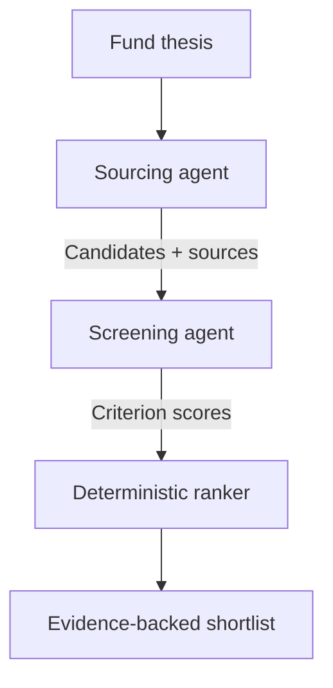

# Architecture

## Workflow

The workflow separates discovery from judgment. The first model call searches broadly for relevant startups. The second independently verifies the candidate set, exposes missing evidence, and applies a consistent rubric. Ranking is calculated in application code so the weighting is transparent and testable.

## Monorepo map

| Path | Responsibility |
|---|---|
| `apps/web` | Thesis input and ranked deal-flow interface |
| `apps/api` | HTTP boundary, validation, and static serving |
| `packages/agents` | Prompts, schemas, OpenAI calls, and orchestration |
| `packages/shared` | Runtime configuration |
| `tests` | Deterministic scoring tests |

## Design principles

- Evidence before enthusiasm: unsupported claims lower confidence.
- Facts before inference: agents are instructed to distinguish the two.
- Transparent scoring: weights live in `scoring.mjs`, outside the prompt.
- Human decision rights: recommendations support, but never replace, IC judgment.
- No secret persistence: API keys stay server-side and are ignored by Git.

## Production extensions

1. Add authentication and per-fund thesis profiles.
2. Persist runs, companies, evidence, and analyst decisions in Postgres.
3. Add scheduled sourcing and deduplicate candidates across runs.
4. Ingest private fund documents with file search.
5. Add analyst feedback and an evaluation set before tuning prompts.
6. Add source freshness checks, domain allowlists, rate limits, and cost budgets.
